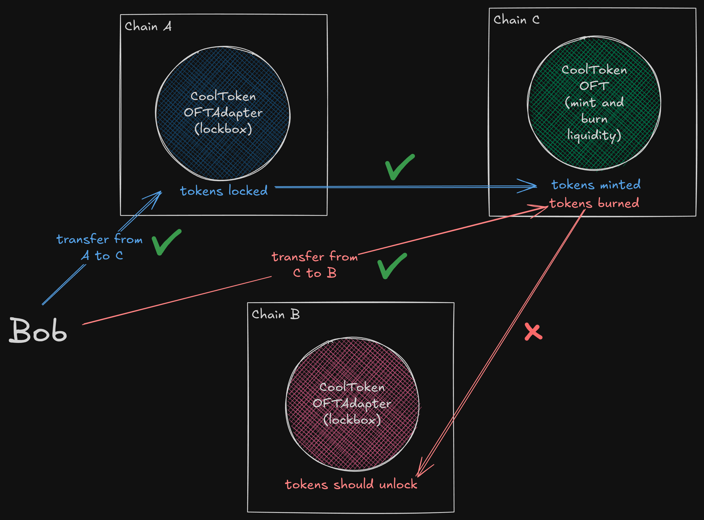

# Universal questions

## #1

An edge case for LayerZero protocol happens when there are two lockbox (`OFTAdapter`) contracts in the cross-chain mesh of an omnichain project. Imagine token `CoolToken` is deployed on 3 chains: two `OFTAdapter`s on chains A and B, and an `OFT` (mint and burn liquidity) on chain C. Let's say Bob wants to transfer `CoolToken` from chain A to chain C. So, tokens are locked on chain A and minted on chain C. The transfer is successful. Now he wants to transfer from chain C to chain B. Tokens are then burned on chain C (tx on chain C successful ✅), but since there is no liquidity on chain B, the transaction on the destination chain will revert and funds will be lost on chain C.

### Solution

Ideally, don't use lockboxes at all in a cross-chain application. However, if the project really needs a lockbox contract, use only one in the entire mesh and allow tokens issuance only on the chain where the lockbox contract lives. This way, the lack of liquidity problem will never happen.

## #2

Check `src/UniswapV2Fork.sol`.

### Solution

Run `forge test -vv` and check the logs. You'll see the pool being drained. Check `test/UniswapV2ForkTest.t.sol` to understand the logic.

This drain of funds is possible because at line 262 of `UniswapV2Fork.sol` it's been used `1000` instead of `10000`, which breaks the invariant (constant product AMM: $x \cdot y \ge k$).

